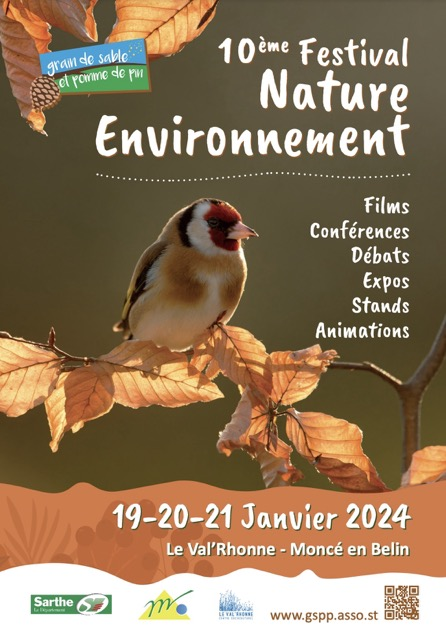

## Festival Nature

Les 19, 20 et 21 Janvier 2024, GSPP organise la 10ème édition de son festival nature et environnement, au Val'Rhonne à Moncé-en-Belin.

Au programme : films, diaporamas, conférences et débats, forum avec de nombreux stands et expositions.

[Consulter le programme 2024](/pdf/festnat-programme-2024.pdf)

---

## Retour en images sur le festival 2024

<lite-youtube videoid="tYWYXD-SfvI" playlabel="Retour en images sur le festival 2024"></lite-youtube>

## LMtv Sarthe au festival 2024

<lite-youtube videoid="tEsVVdQZ9Gc" playlabel="LMtv Sarthe au festival 2024"></lite-youtube>

## Bande annonce du festival 2024

<lite-youtube videoid="TqA5GQtwIeI" playlabel="Bande annonce festival 2024"></lite-youtube>

<small>Réalisée par Gautier Michelin</small>

## Bande annonce du festival 2023

<lite-youtube videoid="QUNwGXtfXuA" playlabel="Bande annonce festival 2023"></lite-youtube>

<small>Réalisée par Daniel Menant</small>

## Bande annonce du festival 2022

Réalisée par Daniel Menant

<lite-youtube videoid="Vw-p0JaicFw" playlabel="Bande annonce festival 2022"></lite-youtube>

<small>Réalisée par Daniel Menant</small>

## Bande annonce du festival 2020

<lite-youtube videoid="5F255OJxrVc" playlabel="Bande annonce festival 2022"></lite-youtube>

<small>Réalisée par Daniel Menant</small>